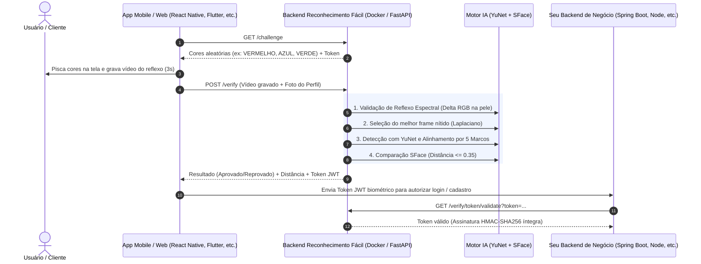

# 🛡️ Reconhecimento Fácil

> **Microsserviço Universal Open-Source de Prova de Vida Ativa (Anti-Spoofing Espectral) e Reconhecimento Facial 1:1 com IA (YuNet + SFace).**

[](https://www.docker.com/)
[](https://fastapi.tiangolo.com/)
[](https://opencv.org/)
[](https://expo.dev/)
[](LICENSE)

---

## 📌 Visão Geral

O **Reconhecimento Fácil** é uma solução completa, leve e agnóstica de plataforma desenvolvida para autenticação biométrica facial e combate a fraudes de identidade (anti-spoofing). 

Ele combina:
1. **Prova de Vida Ativa por Flash Espectral (Desafio-Resposta):** A tela do dispositivo pisca uma sequência de cores aleatórias enquanto filma o usuário. O backend analisa fisicamente a reflexão de luz ($\Delta$ RGB) na pele do rosto, tornando impossível fraudar o sistema com fotos impressas, telas de outros celulares ou máscaras estáticas.
2. **Reconhecimento Facial 1:1 com Redes Neurais (YuNet + SFace):** Detecta 5 marcos anatômicos faciais (olhos, nariz e cantos da boca), alinha o rosto matematicamente em 112x112 pixels e compara com a foto de perfil cadastrada em apenas **5 milissegundos**.
3. **Segurança Criptográfica & Rate Limiting:** Emite **Token JWT assinado (HS256)** para atestar a aprovação biométrica ao seu backend principal e protege contra ataques de força bruta.

---

## 🌐 Onde ele funciona? (Compatibilidade Universal)

O backend do **Reconhecimento Fácil** foi projetado como uma **API REST Universal (HTTP/JSON + Multipart)**. Ele é 100% desacoplado e funciona integrado a qualquer cliente:

| Plataforma | Suporte | Tecnologias Típicas |
| :--- | :---: | :--- |
| 📱 **React Native / Expo** | ✅ Nativo | Exemplo completo funcional incluso na pasta `/mobile` (Expo SDK 54). |
| 💙 **Flutter** | ✅ Suportado | Pacotes `camera` e `http` / `dio` (veja exemplo abaixo). |
| 🌐 **Web (Browsers)** | ✅ Suportado | React, Next.js, Vue, Angular, HTML5 (`getUserMedia` + Canvas). |
| 🤖 **Android Nativo** | ✅ Suportado | Kotlin / Java com CameraX e Retrofit. |
| 🍏 **iOS Nativo** | ✅ Suportado | Swift com AVFoundation e URLSession. |
| ☕ **Backends de Negócio** | ✅ Suportado | Spring Boot (Java), Node.js, NestJS, Django, Go, PHP, etc. |

---

## 📐 Arquitetura do Sistema



---

## ⚙️ Pré-requisitos

Para rodar o projeto você precisa apenas de:
* **Docker** e **Docker Compose** instalados (método recomendado para o backend).
* **Node.js 18+** (apenas se for rodar o aplicativo de teste em React Native).
* Um celular Android ou iOS conectado na mesma rede Wi-Fi do computador.

---

## 🚀 Como Executar o Projeto

### 1️⃣ Subindo o Backend (API em Docker)

O backend contém todas as dependências pré-instaladas (Python 3.11, OpenCV Headless, FastAPI e os modelos ONNX):

```bash
# Clone o repositório
git clone https://github.com/Abraao-SPX/Reconhecimeto_Facil.git
cd Reconhecimeto_Facil/backend

# Inicie o container
docker compose up -d --build
```

O serviço estará disponível em `http://localhost:8000`.
* Documentação Swagger interativa: `http://localhost:8000/docs`
* Health Check: `http://localhost:8000/health`

---

### 2️⃣ Subindo o App Mobile (Exemplo React Native / Expo)

Na raiz do repositório:

```bash
cd mobile

# Instale as dependências
npm install --legacy-peer-deps

# Inicie o servidor Metro
npx expo start -c
```

1. Um **QR Code** será exibido no terminal.
2. Abra o aplicativo **Expo Go** no seu celular Android ou iOS.
3. Aponte a câmera para ler o QR Code.
4. Pronto! O app abrirá no celular conectado ao backend.

> [!tip] Conexão com o IP do Computador
> Por padrão, o app aponta para o IP local da sua máquina na porta `8000` (ex: `http://192.168.1.44:8000`). Você pode alterar o IP a qualquer momento tocando na engrenagem **"Configurar IP do Servidor"** na tela inicial do app.

---

## 🎯 Modelo Matemático da Prova de Vida

### 1. Reflexo Espectral Relativo ($\Delta$ RGB)
Para resistir a salas com iluminação ambiente (lâmpadas fluorescentes, luz solar), o algoritmo calcula o ganho relativo em cada canal em relação ao frame escuro inicial ($t_0$):

$$\Delta R = \frac{R_t - R_0}{R_0}, \quad \Delta G = \frac{G_t - G_0}{G_0}, \quad \Delta B = \frac{B_t - B_0}{B_0}$$

O canal da cor esperada deve se destacar das demais em pelo menos 10%:
* **VERMELHO:** $\Delta R > 1.10 \times \Delta G$ e $\Delta R > 1.10 \times \Delta B$
* **AZUL:** $\Delta B > 1.10 \times \Delta R$ e $\Delta B > 1.10 \times \Delta G$
* **VERDE:** $\Delta G > 1.10 \times \Delta R$ e $\Delta G > 1.10 \times \Delta B$

### 2. Limiar Biométrico Rigoroso Anti-Fraude
A comparação facial usa o modelo **SFace** com distância de cosseno:

| Distância Obtida | Status | O que representa |
| :--- | :---: | :--- |
| **`0.00` a `0.35`** | **APROVADO ✅** | Rosto real idêntico ao titular cadastrado *(testes reais pontuaram `0.27` a `0.29`)*. |
| **`Acima de 0.35`** | **REPROVADO ❌** | Rosto incompatível, foto na parede, tela de outro celular *(pontuam `0.58`+)*. |

---

## 📡 Documentação dos Endpoints REST

### 1. `GET /health`
Verifica a saúde do serviço e o modelo em execução.
```bash
curl -X GET http://localhost:8000/health
```
**Resposta:**
```json
{
  "status": "ok",
  "service": "Reconhecimento Fácil - Biometrics API",
  "model": "YuNet-SFace",
  "version": "1.1.0"
}
```

---

### 2. `GET /challenge`
Gera a ordem aleatória das cores e o token de sessão para a Prova de Vida.
```bash
curl -X GET http://localhost:8000/challenge
```
**Resposta:**
```json
{
  "session_token": "a8B9kL2xQp0vZt1R",
  "colors": ["VERMELHO", "VERDE", "AZUL"],
  "flash_duration_ms": 750
}
```

---

### 3. `POST /verify`
Valida o vídeo da prova de vida e compara biometricamente contra a foto de cadastro.

**Parâmetros (Multipart/form-data):**
* `video`: Arquivo de vídeo gravado durante o flash (`.mp4`).
* `profile_photo`: Foto de perfil / documento de referência (`.jpg` ou `.png`).
* `expected_colors`: String com as cores do desafio separadas por vírgula (ex: `"VERMELHO,VERDE,AZUL"`).
* `user_id`: Identificador único do usuário no seu sistema.

```bash
curl -X POST http://localhost:8000/verify \
  -F "video=@challenge_video.mp4" \
  -F "profile_photo=@minha_foto.jpg" \
  -F "expected_colors=VERMELHO,VERDE,AZUL" \
  -F "user_id=usuario_123"
```

**Resposta de Sucesso:**
```json
{
  "verified": true,
  "is_live": true,
  "distance": 0.2707,
  "threshold": 0.35,
  "jwt_token": "eyJhbGciOiJIUzI1NiIsInR5cCI6IkpXVCJ9...",
  "status": "Identidade confirmada com sucesso!"
}
```

---

### 4. `GET /verify/token/validate`
Permite ao seu backend principal validar se o Token JWT emitido é autêntico e não foi forjado.
```bash
curl -X GET "http://localhost:8000/verify/token/validate?token=eyJhbGciOi..."
```

---

## 📱 Exemplo de Integração em Flutter

Integrar o **Reconhecimento Fácil** no Flutter é simples usando `http`:

```dart
import 'package:http/http.dart' as http;
import 'dart:convert';

Future<void> verificarBiometria(String videoPath, String fotoPath, String cores, String userId) async {
  var uri = Uri.parse('http://SEU_IP:8000/verify');
  var request = http.MultipartRequest('POST', uri);

  request.fields['expected_colors'] = cores;
  request.fields['user_id'] = userId;
  request.files.add(await http.MultipartFile.fromPath('video', videoPath));
  request.files.add(await http.MultipartFile.fromPath('profile_photo', fotoPath));

  var streamedResponse = await request.send();
  var response = await http.Response.fromStream(streamedResponse);

  if (response.statusCode == 200) {
    var data = jsonDecode(response.body);
    if (data['verified'] == true) {
      print('Aprovado! Distância: ${data['distance']}');
      print('Token JWT: ${data['jwt_token']}');
    } else {
      print('Reprovado: ${data['status']}');
    }
  }
}
```

---

## 🧪 Testes Automatizados

O repositório já inclui suítes completas de testes unitários e de estresse dentro de `backend/`:

```bash
# Executa suíte de visão computacional e anti-spoofing
python3 test_liveness.py

# Executa suíte de estresse, criptografia JWT e rate limiting
python3 test_stress.py
```

Resultados cobertos:
* ✅ Rejeição imediata de vídeos sem rosto.
* ✅ Seleção Laplaciana de nitidez sob desfoque severo.
* ✅ Aprovação de reflexo espectral real e bloqueio de spoofing cinza/estático.
* ✅ Assinatura digital HMAC-SHA256 e bloqueio de tokens adulterados com HTTP 401.
* ✅ Rate Limiting protegendo contra força bruta com HTTP 429 após 5 requisições rápidas.
* ✅ Tolerância a formatos PNG, WEBP, JPG e arquivos corrompidos.

---

## 📄 Licença

Distribuído sob a licença **MIT**. Veja `LICENSE` para mais informações. Livre para uso comercial e pessoal.
