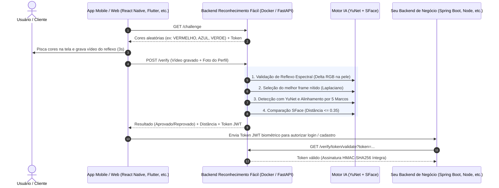

# 🛡️ Reconhecimento Fácil

> **Microsserviço Universal Open-Source de Prova de Vida Ativa (Anti-Spoofing Espectral) e Reconhecimento Facial 1:1 com IA (YuNet + SFace).**

[](https://www.docker.com/)
[](https://fastapi.tiangolo.com/)
[](https://opencv.org/)
[](https://expo.dev/)
[](LICENSE)

---

## 📌 Visão Geral

O **Reconhecimento Fácil** é uma solução completa, leve e agnóstica de plataforma desenvolvida para autenticação biométrica facial e combate a fraudes de identidade (anti-spoofing). 

Ele combina:
1. **Prova de Vida Ativa por Flash Espectral (Desafio-Resposta):** A tela do dispositivo pisca uma sequência de cores aleatórias enquanto filma o usuário. O backend analisa fisicamente a reflexão de luz ($\Delta$ RGB) na pele do rosto, tornando impossível fraudar o sistema com fotos impressas, telas de outros celulares ou máscaras estáticas.
2. **Reconhecimento Facial 1:1 com Redes Neurais (YuNet + SFace):** Detecta 5 marcos anatômicos faciais (olhos, nariz e cantos da boca), alinha o rosto matematicamente em 112x112 pixels e compara com a foto de perfil cadastrada em apenas **5 milissegundos**.
3. **Segurança Criptográfica & Rate Limiting:** Emite **Token JWT assinado (HS256)** para atestar a aprovação biométrica ao seu backend principal e protege contra ataques de força bruta.

---

## 🌐 Onde ele funciona? (Compatibilidade Universal)

O backend do **Reconhecimento Fácil** foi projetado como uma **API REST Universal (HTTP/JSON + Multipart)**. Ele é 100% desacoplado e funciona integrado a qualquer cliente:

| Plataforma | Suporte | Tecnologias Típicas |
| :--- | :---: | :--- |
| 📱 **React Native / Expo** | ✅ Nativo | Exemplo completo funcional incluso na pasta `/mobile` (Expo SDK 54). |
| 💙 **Flutter** | ✅ Suportado | Pacotes `camera` e `http` / `dio` (veja exemplo abaixo). |
| 🌐 **Web (Browsers)** | ✅ Suportado | React, Next.js, Vue, Angular, HTML5 (`getUserMedia` + Canvas). |
| 🤖 **Android Nativo** | ✅ Suportado | Kotlin / Java com CameraX e Retrofit. |
| 🍏 **iOS Nativo** | ✅ Suportado | Swift com AVFoundation e URLSession. |
| ☕ **Backends de Negócio** | ✅ Suportado | Spring Boot (Java), Node.js, NestJS, Django, Go, PHP, etc. |

---

## 📐 Arquitetura do Sistema


```mermaid
sequenceDiagram
    autonumber
    actor U as Usuário / Cliente
    participant App as App Mobile / Web (React Native, Flutter, etc.)
    participant API as Backend Reconhecimento Fácil (Docker / FastAPI)
    participant Core as Motor IA (YuNet + SFace)
    participant Back as Seu Backend de Negócio (Spring Boot, Node, etc.)

    App->>API: GET /challenge
    API-->>App: Cores aleatórias (ex: VERMELHO, AZUL, VERDE) + Token
    App->>U: Pisca cores na tela e grava vídeo do reflexo (3s)
    App->>API: POST /verify (Vídeo gravado + Foto do Perfil)
    
    rect rgb(240, 245, 255)
        API->>Core: 1. Validação de Reflexo Espectral (Delta RGB na pele)
        API->>Core: 2. Seleção do melhor frame nítido (Laplaciano)
        API->>Core: 3. Detecção com YuNet e Alinhamento por 5 Marcos
        API->>Core: 4. Comparação SFace (Distância <= 0.35)
    end

    API-->>App: Resultado (Aprovado/Reprovado) + Distância + Token JWT
    App->>Back: Envia Token JWT biométrico para autorizar login / cadastro
    Back->>API: GET /verify/token/validate?token=...
    API-->>Back: Token válido (Assinatura HMAC-SHA256 íntegra)
```

---

## ⚙️ Pré-requisitos

Para rodar o projeto você precisa apenas de:
* **Docker** e **Docker Compose** instalados (método recomendado para o backend).
* **Node.js 18+** (apenas se for rodar o aplicativo de teste em React Native).
* Um celular Android ou iOS conectado na mesma rede Wi-Fi do computador.

---

## 🚀 Como Executar o Projeto

### 1️⃣ Subindo o Backend (API em Docker)

O backend contém todas as dependências pré-instaladas (Python 3.11, OpenCV Headless, FastAPI e os modelos ONNX):

```bash
# Clone o repositório
git clone https://github.com/Abraao-SPX/Reconhecimeto_Facil.git
cd Reconhecimeto_Facil/backend

# Inicie o container
docker compose up -d --build
```

O serviço estará disponível em `http://localhost:8000`.
* Documentação Swagger interativa: `http://localhost:8000/docs`
* Health Check: `http://localhost:8000/health`

---

### 2️⃣ Subindo o App Mobile (React Native / Expo SDK 54)

Na raiz do repositório:

```bash
cd mobile

# Instale as dependências (atenção à flag para compatibilidade de dependências peer)
npm install --legacy-peer-deps

# Inicie o servidor Metro
npx expo start -c
```

1. Um **QR Code** será exibido no terminal.
2. Abra o aplicativo **Expo Go** no seu celular Android ou iOS.
3. Aponte a câmera para ler o QR Code.
4. O app abrirá conectado ao backend configurado.

> [!tip] Configuração Dinâmica da URL do Servidor
> Por padrão, o app consulta uma lista de servidores candidatos definida em `CANDIDATE_SERVERS` no topo de `mobile/App.tsx`. Você pode apontar para qualquer IP ou domínio tocando no ícone de engrenagem ⚙️ **"Configurar IP do Servidor"** diretamente na tela inicial do app.

---

## 🛠️ Guia de Implantação e Operação para Equipes

Para que a solução funcione com estabilidade máxima em **redes externas, 4G/5G e Wi-Fi residencial**, a equipe deve observar os seguintes pontos arquiteturais:

### 1. Requisitos de Rede e Proxy Reverso (Evitando o Erro "Network Request Failed")
Ambientes de produção e redes móveis/Wi-Fi possuem particularidades que foram resolvidas nesta versão:

* **HTTPS Obrigatório:** No Android 9+ e iOS, conexões HTTP puras em texto claro são bloqueadas pelo sistema operacional. Em produção, use sempre HTTPS válido (Let's Encrypt ou Cloudflare).
* **Timeout de NAT em Roteadores Residenciais (`Connection: close`):** Roteadores Wi-Fi domésticos costumam derrubar o mapeamento NAT de conexões TCP ociosas após 5 segundos. Como o app faz um `GET /users` ao abrir e o usuário leva alguns segundos para clicar em "Reconhecer", o socket ficava ocioso e caía.
  * **Solução:** No Nginx da sua VPS / Reverse Proxy, configure:
    ```nginx
    keepalive_timeout 0;
    ```
    Isso força o envio do cabeçalho `Connection: close`, garantindo que cada requisição abra um socket TCP limpo e nunca congele no Wi-Fi.
* **Túnel Cloudflare Anycast (Opção Recomendada para Bypass de CGNAT):**
  Se o servidor estiver atrás de CGNAT ou firewall restritivo, execute um túnel Cloudflare gratuito:
  ```bash
  cloudflared tunnel --url http://localhost:8000
  ```
  Isso roteia o tráfego pela rede Anycast da Cloudflare com terminação TLS ultrarrápida.
* **MTU e MSS Clamping:** Para evitar perda de pacotes em conexões de fibra doméstica (PPPoE), certifique-se de ativar o MSS Clamping no firewall da VPS:
  ```bash
  sudo iptables -t mangle -A FORWARD -p tcp --tcp-flags SYN,RST SYN -j TCPMSS --clamp-mss-to-pmtu
  ```

---

### 2. Arquitetura Mobile de Alta Resiliência (`mobile/App.tsx`)
O aplicativo mobile foi otimizado para eliminar qualquer gargalo de conectividade:

* **Axios com Timeout Resiliente:** Substituiu o `fetch()` nativo do React Native, eliminando vazamento de sinais de abort no pool de conexões do OkHttp.
* **Prefetch de Desafio em Background:** Ao clicar em "Reconhecer" ou "Cadastrar", o app requisita `GET /challenge` em segundo plano durante a contagem regressiva visual (3, 2, 1). Quando a contagem zera, as cores do desafio e o token de sessão já estão na memória, iniciando o flash de tela com latência zero.
* **Gravação Balanceada (480p a 1.2 Mbps):** O vídeo é gravado em resolução 480p a 1.2 Mbps por 3 segundos (~500 KB), garantindo upload ultrarrápido mesmo em redes móveis com sinal fraco.
* **Brilho Seguro:** O ajuste temporário para brilho máximo (para reflexo espectral ideal) é encapsulado com tratamento de exceção seguro, não travando em aparelhos com restrição de permissão de sistema.

---

### 3. Geração de APK e Atualizações Remotas (EAS Build & Update)

Para compilar ou distribuir novas versões sem passar pelas lojas:

```bash
cd mobile

# 1. Login no Expo Application Services
npx eas-cli login

# 2. Compilar APK Standalone Android (perfil preview)
npx eas-cli build -p android --profile preview

# 3. Publicar Atualização Remota Over-The-Air (OTA) instantânea
npx eas-cli update --channel preview --message "Melhoria de estabilidade"
```

> [!important] Regra de Compatibilidade OTA
> Para que uma atualização OTA via `eas update` seja aplicada no app do usuário, a propriedade `runtimeVersion` em `mobile/app.json` deve corresponder exatamente ao valor configurado na compilação do APK instalado (ex: `"1.3.5"`).

---

## 🎯 Modelo Matemático da Prova de Vida

### 1. Reflexo Espectral Relativo ($\Delta$ RGB)
Para resistir a salas com iluminação ambiente (lâmpadas fluorescentes, luz solar), o algoritmo calcula o ganho relativo em cada canal em relação ao frame escuro inicial ($t_0$):

$$\Delta R = \frac{R_t - R_0}{R_0}, \quad \Delta G = \frac{G_t - G_0}{G_0}, \quad \Delta B = \frac{B_t - B_0}{B_0}$$

O canal da cor esperada deve se destacar das demais em pelo menos 10%:
* **VERMELHO:** $\Delta R > 1.10 \times \Delta G$ e $\Delta R > 1.10 \times \Delta B$
* **AZUL:** $\Delta B > 1.10 \times \Delta R$ e $\Delta B > 1.10 \times \Delta G$
* **VERDE:** $\Delta G > 1.10 \times \Delta R$ e $\Delta G > 1.10 \times \Delta B$

### 2. Limiar Biométrico Rigoroso Anti-Fraude
A comparação facial usa o modelo **SFace** com distância de cosseno:

| Distância Obtida | Status | O que representa |
| :--- | :---: | :--- |
| **`0.00` a `0.35`** | **APROVADO ✅** | Rosto real idêntico ao titular cadastrado *(testes reais pontuaram `0.27` a `0.29`)*. |
| **`Acima de 0.35`** | **REPROVADO ❌** | Rosto incompatível, foto na parede, tela de outro celular *(pontuam `0.58`+)*. |

---

## 📡 Documentação dos Endpoints REST

### 1. `GET /health`
Verifica a saúde do serviço, modelos carregados e versão em execução.
```bash
curl -X GET http://localhost:8000/health
```
**Resposta:**
```json
{
  "status": "ok",
  "service": "Reconhecimento Fácil - Biometrics API",
  "model": "YuNet-SFace + MiniFASNet-V2",
  "anti_spoofing": "MiniFASNetV2",
  "yunet": true,
  "sface": true,
  "version": "1.3.0"
}
```

---

### 2. `GET /challenge`
Gera a ordem aleatória das cores e o token de sessão para a Prova de Vida. O `session_token` deve ser reenviado em `/verify` ou `/register` para binding criptográfico do desafio (TTL: 2 minutos, uso único).
```bash
curl -X GET http://localhost:8000/challenge
```
**Resposta:**
```json
{
  "session_token": "a8B9kL2xQp0vZt1R",
  "colors": ["VERMELHO", "VERDE", "AZUL"],
  "flash_duration_ms": 500
}
```

---

### 3. `POST /register`
Cadastra a biometria facial de um novo usuário diretamente ao vivo via vídeo gravado da câmera, sem necessidade de foto da galeria.

**Parâmetros (Multipart/form-data):**
* `video` *(obrigatório)*: Arquivo de vídeo gravado durante o flash (`.mp4`).
* `name` *(obrigatório)*: Nome completo do usuário.
* `expected_colors` *(opcional)*: Cores do desafio para validação de prova de vida.
* `session_token` *(opcional)*: Token retornado por `/challenge` para binding do desafio.
* `user_id` *(opcional)*: ID customizado; se omitido, é gerado automaticamente.

```bash
curl -X POST http://localhost:8000/register \
  -F "video=@register_video.mp4" \
  -F "name=Abraão da Silva" \
  -F "expected_colors=VERMELHO,VERDE,AZUL" \
  -F "session_token=a8B9kL2xQp0vZt1R"
```

**Resposta de Sucesso:**
```json
{
  "success": true,
  "user_id": "user_1695000000_abc123",
  "name": "Abraão da Silva",
  "photo_url": "/faces/user_1695000000_abc123_anchor.jpg",
  "samples_count": 1,
  "message": "Biometria facial de Abraão da Silva cadastrada com sucesso!"
}
```

---

### 4. `POST /verify`
Verificação biométrica ao vivo contra o banco de dados (1:N ou 1:1) ou foto de perfil enviada.

**Parâmetros (Multipart/form-data):**
* `video` *(obrigatório)*: Arquivo de vídeo gravado durante o flash (`.mp4`).
* `expected_colors` *(obrigatório)*: Cores do desafio separadas por vírgula.
* `session_token` *(opcional)*: Token de `/challenge` para binding criptográfico.
* `profile_photo` *(opcional)*: Foto de referência (modo legado; dispensável se o banco já possui usuários).
* `user_id` *(opcional)*: Para comparação 1:1 contra um usuário específico.

```bash
curl -X POST http://localhost:8000/verify \
  -F "video=@challenge_video.mp4" \
  -F "expected_colors=VERMELHO,VERDE,AZUL" \
  -F "session_token=a8B9kL2xQp0vZt1R"
```

**Resposta de Sucesso:**
```json
{
  "verified": true,
  "is_live": true,
  "distance": 0.2707,
  "threshold": 0.35,
  "samples_count": 3,
  "adaptive_updated": true,
  "jwt_token": "eyJhbGciOiJIUzI1NiIsInR5cCI6IkpXVCJ9...",
  "matched_user": {"id": "user_123", "name": "Abraão", "samples_count": 3},
  "status": "Olá Abraão! Login biométrico aprovado!"
}
```

---

### 5. `GET /verify/token/validate`
Permite ao seu backend principal validar se o Token JWT emitido é autêntico e não foi forjado.
```bash
curl -X GET "http://localhost:8000/verify/token/validate?token=eyJhbGciOi..."
```

---

### 6. `GET /users`
Lista todos os usuários cadastrados com contagem de amostras biométricas aprendidas.
```bash
curl -X GET http://localhost:8000/users
```

---

### 7. `GET /users/{user_id}/history`
Retorna o histórico de amostras biométricas aprendidas nos logins de um usuário específico.
```bash
curl -X GET http://localhost:8000/users/user_123/history
```

---

### 8. `DELETE /users/{user_id}`
Remove um usuário, suas fotos biométricas e todo o histórico de amostras.
```bash
curl -X DELETE http://localhost:8000/users/user_123
```

---

### 9. `POST /detect_face`
Inferência rápida (<30ms) que verifica se há um rosto humano enquadrado e centralizado na câmera. Usado pelo app mobile para pré-enquadramento antes da gravação.
```bash
curl -X POST http://localhost:8000/detect_face \
  -H "Content-Type: application/json" \
  -d '{"image_base64": "base64_encoded_image..."}'
```

---

### 10. `GET /audit/logs`
Retorna os registros de auditoria antifraude (agora persistidos em SQLite).
```bash
curl -X GET "http://localhost:8000/audit/logs?limit=50"
```

---

## 📱 Exemplo de Integração em Flutter

Integrar o **Reconhecimento Fácil** no Flutter é simples usando `http`:

```dart
import 'package:http/http.dart' as http;
import 'dart:convert';

Future<void> verificarBiometria(String videoPath, String fotoPath, String cores, String userId) async {
  var uri = Uri.parse('http://SEU_IP:8000/verify');
  var request = http.MultipartRequest('POST', uri);

  request.fields['expected_colors'] = cores;
  request.fields['user_id'] = userId;
  request.files.add(await http.MultipartFile.fromPath('video', videoPath));
  request.files.add(await http.MultipartFile.fromPath('profile_photo', fotoPath));

  var streamedResponse = await request.send();
  var response = await http.Response.fromStream(streamedResponse);

  if (response.statusCode == 200) {
    var data = jsonDecode(response.body);
    if (data['verified'] == true) {
      print('Aprovado! Distância: ${data['distance']}');
      print('Token JWT: ${data['jwt_token']}');
    } else {
      print('Reprovado: ${data['status']}');
    }
  }
}
```

---

## 🧪 Testes Automatizados

O repositório já inclui suítes completas de testes unitários e de estresse dentro de `backend/`:

```bash
# Executa todas as suítes com pytest (recomendado)
cd backend && pytest -v

# Ou individualmente:
python3 test_liveness.py        # Visão computacional e anti-spoofing
python3 test_stress.py          # Estresse, criptografia JWT e rate limiting
python3 test_adaptive_learning.py  # Biometria adaptativa com aprendizado contínuo
```

Resultados cobertos:
* ✅ Rejeição imediata de vídeos sem rosto.
* ✅ Seleção Laplaciana de nitidez sob desfoque severo.
* ✅ Aprovação de reflexo espectral real e bloqueio de spoofing cinza/estático.
* ✅ MiniFASNet V2 bloqueio de telas de PC e fotos impressas.
* ✅ Assinatura digital HMAC-SHA256 e bloqueio de tokens adulterados com HTTP 401.
* ✅ Rate Limiting com limpeza automática de IPs (HTTP 429 após 5 requisições rápidas).
* ✅ Tolerância a formatos PNG, WEBP, JPG e arquivos corrompidos.
* ✅ Cadastro sem comparação prévia e aprendizado adaptativo contínuo.

---

## 🎖️ Créditos e Atribuições Open Source

Este projeto integra tecnologias de ponta desenvolvidas pela comunidade global de código aberto:

* **[OpenCV Zoo - YuNet](https://github.com/opencv/opencv_zoo/tree/main/models/face_detection_yunet):** Modelo ultrarrápido de detecção facial e 5 marcos anatômicos desenvolvido por Shiqi Yu et al. (Licença Apache 2.0).
* **[OpenCV Zoo - SFace](https://github.com/opencv/opencv_zoo/tree/main/models/face_recognition_sface):** Rede neural de extração de características faciais baseada em SphereFace desenvolvida por Zhong et al. (Licença Apache 2.0).
* **[MiniFASNet](https://github.com/yakhyo/face-anti-spoofing):** Rede neural leve para detecção de ataques de apresentação e anti-spoofing facial (Licença Apache 2.0).
* **[FastAPI](https://fastapi.tiangolo.com/):** Framework web assíncrono de alta performance desenvolvido por Sebastián Ramírez (Licença MIT).
* **[Expo / React Native](https://expo.dev/):** Plataforma para desenvolvimento mobile nativo multiplataforma (Licença MIT).

---

## 📄 Licença

Distribuído sob a licença **Apache 2.0** por **Abraão Paixão**. Consulte o arquivo [`LICENSE`](LICENSE) para mais informações. Permite uso pessoal, acadêmico, comercial, modificações e confere proteção mútua de patentes.
